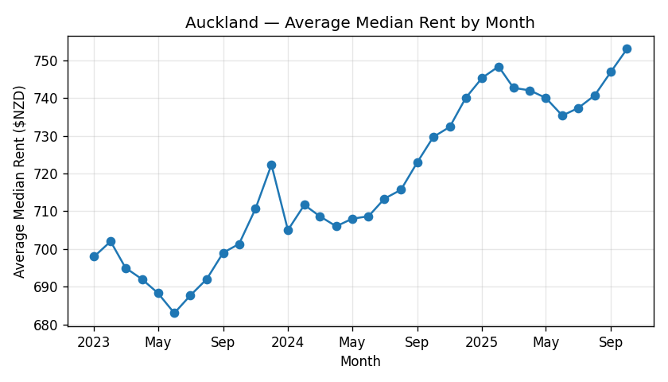
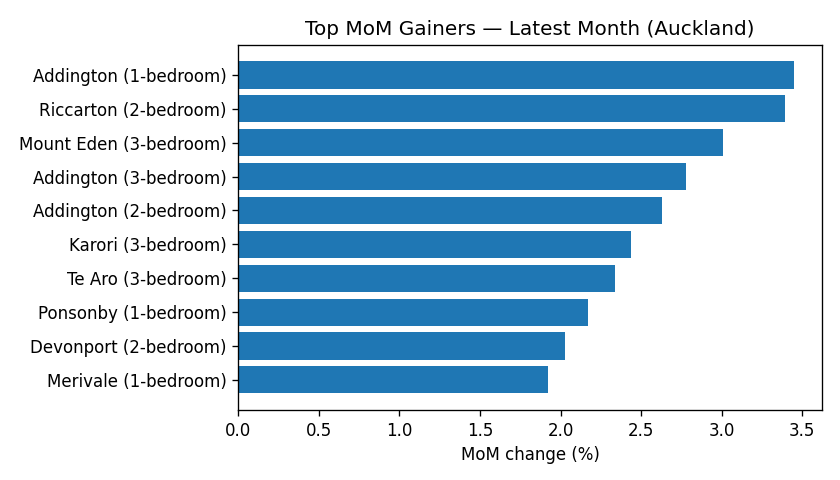
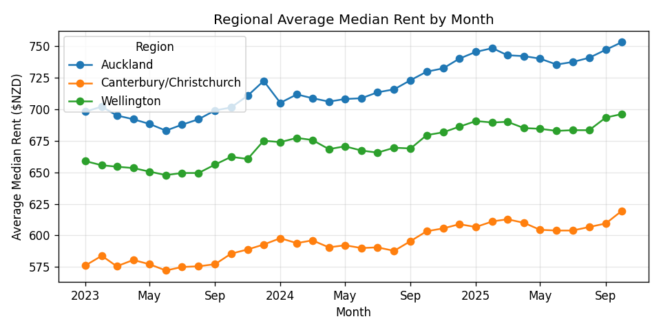
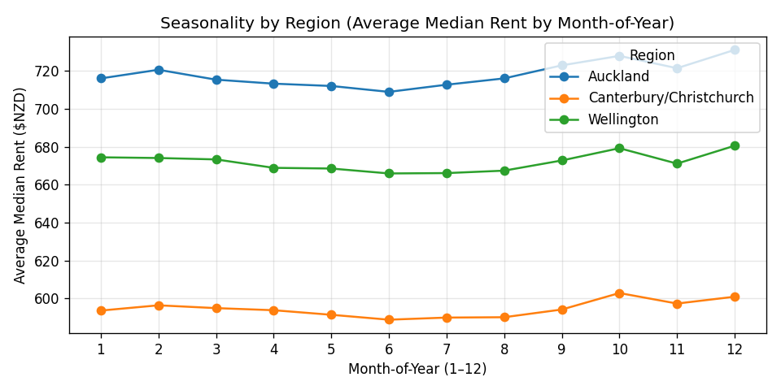
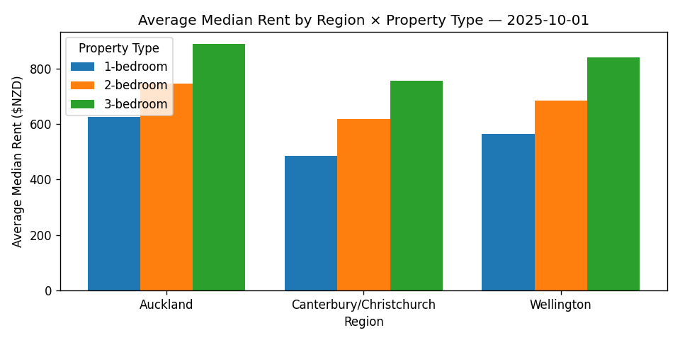

# New Zealand Housing & Rental Analytics (SQL + Python)

## Project Overview
This project builds a **mini data warehouse** for analysing housing rental prices across major regions in New Zealand.  
It demonstrates **SQL data modelling**, **ETL**, and **analytical querying** skills using a simulated yet realistic dataset inspired by real rental market behaviour.

The workflow follows a **Dimensional (Star) Schema** design in MySQL, integrates with **Python (pandas + SQLAlchemy)** for ETL and visualisation, and produces trend and seasonality insights across multiple regions.

---
## Update (17-Oct-2025):
#### **New Zealand Rental Analytics Dashboard**

*SQL + Azure Databricks + Tableau Public*

Built a complete **data-analytics pipeline** for New Zealand rental-price trends.

* Designed a **Star Schema (1 Fact + 3 Dimensions)** and implemented **Bronze → Silver → Gold** layers on Azure Databricks (Standard Tier).
* Processed and cleaned housing data using **PySpark & SQL**, producing analytical tables for trend, growth, and volatility.
* Visualised insights in **Tableau Public**:

  * *Trendline:* average rent by region and month.
  * *Top MoM Gainers:* fastest-growing suburbs.
  * *Volatility:* 3-month rolling rent deviation.
* Published an **interactive dashboard and story** online for public viewing.

**Skills:** SQL, Databricks Delta Lake, PySpark, Data Modeling, ETL, Tableau Public, Data Storytelling
**Live Dashboard:** [View on Tableau Public](https://public.tableau.com/views/NZRentalAnalyticsDashboard/NZRentalInsightsStory?:language=en-US&:sid=&:redirect=auth&:display_count=n&:origin=viz_share_link)

## Update (16-Oct-2025):
**Databricks Cloud Edition available:**  
See [`notebooks/databricks/README_Databricks.md`](notebooks/databricks/README_Databricks.md)
for the Azure Databricks version (Bronze–Silver–Gold architecture).

## Tech Stack
| Component | Technology |
|:--|:--|
| Database | **MySQL 8** – Star Schema (1 fact + 3 dimensions) |
| Data Processing | **Python 3** (pandas, SQLAlchemy, python-dotenv) |
| Visualisation | **matplotlib**, **Jupyter Notebook** |
| Data Source | Synthetic open dataset, modelled on Stats NZ / MBIE rental statistics |

---

## Repository Structure
```

sql/                 → schema creation & ETL scripts
data/
├─ staging/         → staging CSVs (synthetic input)
└─ processed/       → aggregated query outputs
notebooks/           → main analysis notebook (ETL + analytics)
reports/
├─ figures/         → generated charts (PNG)
└─ rental_report.md → optional summary report

```

---

## Dataset Description
The dataset simulates **regional rental behaviour** in New Zealand from Jan 2024 – Oct 2024.

| Feature | Description |
|:--|:--|
| **Regions** | Auckland, Wellington, Canterbury/Christchurch |
| **Suburbs** | Several representative suburbs per region (with fixed coordinates) |
| **Property Types** | 1-bedroom, 2-bedroom, 3-bedroom |
| **Seasonality** | Higher rents in summer months (Dec – Feb), lower in winter (Jun – Jul) |
| **Trend** | Gradual upward trend, strongest in Auckland, moderate in Wellington, lowest in Christchurch |
| **Noise** | Gaussian noise with rounding to the nearest \$5 for `median_rent`; `count_bonds` fluctuates seasonally (higher around summer and school term starts) |
| **Constraints** | Baseline values preserved for Auckland 2-bedroom Jan–Oct 2024 |

This provides realistic patterns for testing **time-series SQL analytics**, **window functions**, and **regional comparisons**.

---

## Key Analyses
- **Regional Monthly Trends:** average median rent by region and month.  
- **Top Gainers (MoM):** suburbs with the largest month-over-month growth in rent.  
- **3-Month Rolling Volatility:** short-term rental price variability across regions and property types.  
- **Seasonality Insight:** confirms NZ’s summer-winter rent cycle across regions.

---

## Example Visualisations
<p align="center">
  
  <br>
  <em>Figure 1 – Auckland Average Median Rent by Month</em>
</p>

<p align="center">
  
  <br>
  <em>Figure 2 – Top Month-over-Month Gainers</em>
</p>
<p align="center">
  
  <br>
  <em>Figure – Regional average median rent by month</em>
</p>

<p align="center">
  
  <br>
  <em>Figure – Seasonality profile by month-of-year</em>
</p>

<p align="center">
  
  <br>
  <em>Figure – Latest month: region × property type comparison</em>
</p>

---

## Analytical Highlights
- **End-to-end ETL pipeline:** `staging → dimensions → fact` (idempotent and repeatable)  
- **Efficient SQL:** joins, CTEs, window functions (`LAG`, `STDDEV_SAMP`), and normalised joins  
- **Seasonality Detection:** verifies expected summer/winter rent cycle  
- **Python + MySQL Integration:** reproducible analysis via SQLAlchemy & pandas  
- **Professional repository layout:** clean structure for GitHub portfolio or technical interview showcase  

---

## How to Run
1. Create a MySQL database named `nz_rent`.  
2. Execute `sql/00_create_schema.sql` to initialise schema.  
3. Place your CSV file in `data/staging/staging_rent.csv`.  
4. Run the Jupyter notebook `notebooks/rental_insights.ipynb` end-to-end.  
5. Charts are saved automatically to `reports/figures/`.

*(Optional: update CSV with new months or regions to extend the analysis to YoY trends.)*

---

## Deliverables
- **SQL Scripts:** schema + ETL logic  
- **Jupyter Notebook:** analysis & visualisation  
- **Figures:** trendline and top-gainers charts  
- **README:** complete project documentation  

---

## Author Notes
This project was developed as part of a data analytics portfolio to showcase **SQL**, **data modelling**, and **exploratory time-series analysis** skills.  
All data are synthetic. 
Fully reproducible on macOS, Windows, or Linux.

---

© 2025 – New Zealand Housing & Rental Analytics Project
